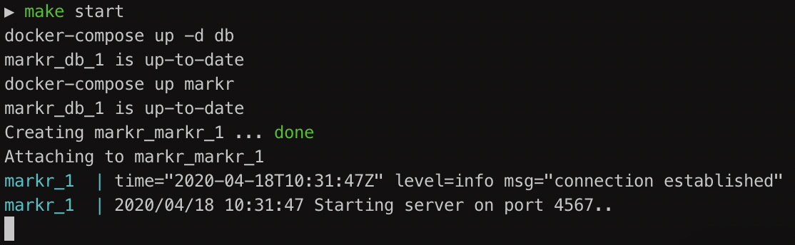

# Markr

A simple API that stores student results in a MySQL database and provides aggregate result data based on the Test ID.

Endpoints available:

* POST `/import`
* GET `/results/{test-id}/aggregate`
* GET `/status` (healthcheck)

Examples when used locally:
```
$ curl -X POST -H 'Content-Type: text/xml+markr' http://localhost:4567/import -d @- <<XML
    <mcq-test-results>
        <mcq-test-result scanned-on="2017-12-04T12:12:10+11:00">
            <first-name>Jane</first-name>
            <last-name>Austin</last-name>
            <student-number>002299</student-number>
            <test-id>1234</test-id>
            <summary-marks available="20" obtained="13" />
        </mcq-test-result>
    </mcq-test-results>
XML
```

```
$ curl http://localhost:4567/results/1234/aggregate
```

```
$ curl http://localhost:4567/status
```


## Getting set up

#### Start the app

Clone the app and `cd` into it (you should be in the root directory), then run:

```
$ make start
```
When you see the following output, the app is accessible on http://localhost:4567 😌


#### Run the tests

This will also output coverage.

```
$ make test
```

#### Access the app container

This will place you in the cli of the markr container.

```
$ make dev
```

Run `go run cmd/*` to start the app.


#### Stop & remove containers

Note this will also remove all of the records saved.

```
$ make kill
```


### Assumptions made

* Since summary marks are provided for each student's result, their individual questions and answers don't need to be recorded
* Currently all incoming requests are being saved, so the database cannot act as source of truth - it was more important to keep a record of everything and filter out bad data later
* Highest available mark is always greater than obtained

### Tools used

* Go 1.14
* Docker Engine 19.03.8
* Golang 1.14 docker image
* Alpine Linux 3.11 docker image
* MySql 8.0 docker image


### Libraries used

* [Gorilla/mux](github.com/gorilla/mux) - request router
* [Go MySQL Driver](github.com/go-sql-driver/mysql) - to interact with `database/sql` types
* [Logrus](github.com/sirupsen/logrus) - structured logger
* [Testify](github.com/stretchr/testify) - assertions in unit tests
* [Stats](github.com/montanaflynn/stats) - calculate stats to average results
* [Sql driver mock](github.com/DATA-DOG/go-sqlmock) - to mock sql driver behaviours in tests


## Improvements & considerations

* Database migrations should be set up for maintainability
* As long as the results are not missing important fields, they are being saved - there's no validation on correctness or duplication
* Current method of filtering out duplicates in memory is not ideal
* More test coverage in db and api package
* Should include integration/smoke test on database connection
* Should save the students' questions/answers in another table with a foreign key reference; for simplicity sake they are currently not recorded
* Adding a cache on the `GET` would improve performance on some requests
* Better encapsulation - eg. Now (time) variable is currently global for testability
* Validation such as missing field checks should return a chain of specific errors to the user, perhaps in an array
* Currently no security on database config or API endpoints
